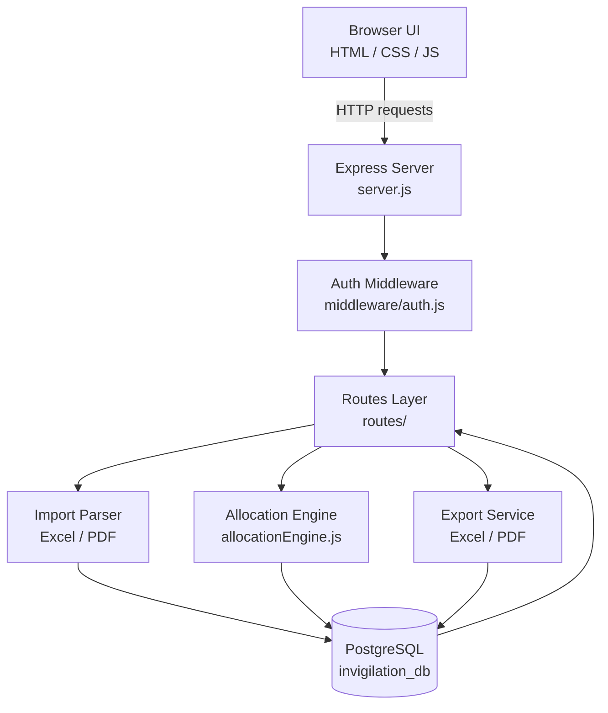

# 🗓️ Smart Invigilation System

Automated exam invigilation duty-chart generation for engineering colleges — built to replace manual, spreadsheet-driven duty allocation with a rule-based engine.


---

## 📖 Table of Contents

- [Overview](#-overview)
- [Key Features](#-key-features)
- [Tech Stack](#-tech-stack)
- [Architecture](#-architecture)
- [Requirements](#-requirements)
- [Setup](#-setup)
- [Deployment Guide](#-deployment-guide)
- [Day-to-Day Usage](#-day-to-day-usage)
- [Import File Formats](#-import-file-formats)
- [Project Structure](#-project-structure)
- [Roadmap / Extending Later](#-roadmap--extending-later)

---

## 🔍 Overview

The Smart Invigilation System generates exam duty charts automatically, taking into account faculty designation, workload fairness, timetable conflicts, availability, and room capacity — so duty allocation goes from a manual, error-prone process to a one-click operation.

The system supports **multi-department, multi-tenant use**: each department logs in to its own isolated workspace (faculty, timetables, exam sessions, and duty sheets are kept fully separate).

---

## ✨ Key Features

| Feature | Description |
|---|---|
| 🏷️ **Priority by Designation** | Configurable priority order across Professor / Associate Professor / Assistant Professor |
| ⚖️ **Duty-Count Fairness** | Faculty with the fewest duties so far are prioritized within their tier |
| 🚫 **Timetable Conflict Check** | Never assigns a faculty member to invigilate during a period they're already teaching |
| 📅 **Availability Management** | Mark specific dates/sessions off manually (e.g. leave) |
| 🏫 **Capacity-Aware Allocation** | Configurable invigilator-to-student ratio (default: 1 per 24 students) |
| 📥 **Bulk Import** | Excel (recommended) or PDF import for faculty, classrooms, and exam sessions |
| ✏️ **Editable Duty Charts** | Reassign or cancel individual duties, then regenerate at any time |
| 📤 **Export** | Download final duty charts as Excel or PDF |

---

## 🧩 Tech Stack

| Layer | Technology |
|---|---|
| **Backend** | Node.js + Express |
| **Database** | PostgreSQL |
| **Frontend** | Vanilla HTML / CSS / JavaScript (no build step, no framework) |
| **Sessions/Auth** | Cookie-based sessions, per-department tenant isolation |
| **Import/Export** | Excel (`.xlsx`) and PDF parsing & generation |
| **Process Management** | PM2 (recommended for production) |
| **Reverse Proxy** | Nginx / Apache (optional, for HTTPS + domain routing) |

---

## 🏗️ Architecture

The system is a single Node.js/Express service that serves both the REST API and the static frontend, backed by one PostgreSQL database with per-department data isolation.



**Request flow, in short:**

1. The browser talks only to the Express server — there is no separate frontend host or API gateway.
2. Every request passes through the **auth middleware**, which scopes it to the logged-in department's workspace (multi-tenant isolation).
3. The **routes layer** dispatches to the relevant service:
   - `importParser.js` — reads uploaded Excel/PDF files and normalizes them into faculty, classroom, and timetable records.
   - `allocationEngine.js` — the core rules engine: checks timetable conflicts, applies designation priority, and balances duty counts.
   - `exportService.js` — renders the generated duty chart back out as Excel or PDF.
4. All state lives in **PostgreSQL**, with every table scoped by department for tenant isolation.

> GitHub renders the diagram above automatically. If you're viewing this elsewhere, see the `allocationEngine.js`, `importParser.js`, and `exportService.js` files under `backend/src/services/` for the same flow in code.

---

## 🔐 Access

Each department has its own login. Department accounts and initial passwords are provisioned separately during setup and are **not included in this document** — see your system administrator, or the setup script used to seed accounts.

> Passwords can be changed anytime under **Settings → Change Account Password**.

---

## 🛠️ Requirements

- Node.js 18+
- PostgreSQL 13+
- npm

---

## ⚙️ Setup

```bash
# 1. Create the database
createdb invigilation_db

# 2. Install backend dependencies
cd backend
npm install

# 3. Configure environment
cp .env.example .env
# edit .env: set PGUSER, PGPASSWORD, ADMIN_USERNAME, ADMIN_PASSWORD, SESSION_SECRET

# 4. Apply the database schema
npm run migrate
# If you already set up this app before the timetable-conflict feature was
# added, run this once to add it without touching existing data:
# psql -d invigilation_db -f src/migrations/001_faculty_timetable.sql

# 5. Start the server
npm start
```

The app (frontend + API) is served entirely from **http://localhost:4000** — the backend serves the `frontend/` folder directly, so there's nothing separate to deploy or configure for the UI.

---

## 🚀 Deployment Guide

This is a single Node.js process plus PostgreSQL — no separate frontend server, no build step, no Docker required (though it will work in one if you prefer).

1. Copy the whole `invigilation-system` folder to the server.
2. Install PostgreSQL if not already present, create the database, and run the setup steps above.
3. Run `npm start` behind a process manager:
   ```bash
   npm install -g pm2
   pm2 start src/server.js --name invigilation
   pm2 save
   pm2 startup
   ```
4. Put it behind your existing web server (Nginx/Apache) as a reverse proxy on port 4000, with HTTPS — or expose the port directly on your campus network.
5. In production, set `COOKIE_SECURE=true` in `.env` once HTTPS is in place.

---

## 📋 Day-to-Day Usage

1. **Faculty** — add individually, or bulk-upload via **Import Data** using `backend/templates/Faculty_Master_Template.xlsx`.
2. **Classrooms** — same, using `Classroom_Master_Template.xlsx`.
3. **Faculty Weekly Timetable** — under **Import Data**, upload your "Individual Load" sheet directly (same format as `Timetables_Load_2026-27.xlsx` → "Individual Load" tab). Import Faculty *before* this, since matching is by exact name. Re-uploading fully replaces each matched faculty member's timetable, so it's safe to re-run each semester.
4. **Exam Sessions** — create an exam session (name, date, FN/AN), then add the rooms being used and student counts — or bulk-upload with `Exam_Room_Allocation_Template.xlsx` (rooms must already exist under Classrooms first).
5. **Generate Duties** — pick the exam session and click **Generate Duty Chart**. The engine checks each candidate's timetable for that weekday and excludes anyone with a class/lab in the exam's period range (FN = periods 1–4, AN = periods 5–8 by default) before applying priority and fairness. Re-running after edits is safe — it recalculates from scratch each time.
6. **Edit** — reassign or cancel individual duties directly in the chart if needed; duty counts adjust automatically so fairness stays accurate for the next generation run.
7. **Settings** — reorder which designation gets picked first, and change the students-per-faculty ratio (default 24).
8. **Export** — download the final chart as Excel or PDF from the **Generate Duties** page.

---

## 📁 Import File Formats

Column headers are matched flexibly (case/spacing-insensitive, common variants accepted), but the templates in `backend/templates/` are the safest starting point.

| File | Columns |
|---|---|
| **Faculty** | Name, Designation, Department, Email, Phone |
| **Classrooms** | Room No, Building, Capacity |
| **Exam Room Allocation** | Exam Name, Date, Session, Room No, Students Count |
| **Workload** *(optional)* | Any sheet with a "Faculty Name" and "Total" column — seeds starting duty counts from an existing workload tracker, matched by name |
| **Faculty Weekly Timetable** | No separate template — upload the "Individual Load" sheet exactly as your college already produces it. The parser reads the repeating name → period-header → Mon–Sat block structure directly |

> PDF import is supported for simple faculty and classroom lists (one entry per line), but Excel is far more reliable — use it whenever you can.

---

## 🗂️ Project Structure

```
invigilation-system/
├── backend/
│   ├── src/
│   │   ├── server.js                 # Express app entry point
│   │   ├── db.js                     # PostgreSQL connection pool
│   │   ├── schema.sql                # Full database schema
│   │   ├── migrate.js                # Applies schema.sql
│   │   ├── routes/                   # API endpoints
│   │   ├── services/
│   │   │   ├── allocationEngine.js   # Core duty-assignment logic
│   │   │   ├── importParser.js       # Excel/PDF import parsing
│   │   │   └── exportService.js      # Excel/PDF duty chart export
│   │   └── middleware/auth.js
│   └── templates/                    # Starter Excel files for imports
└── frontend/
    ├── index.html
    ├── css/style.css                 # White/black sidebar UI
    └── js/                           # Vanilla JS, one file per screen
```

No frontend build step — it's plain HTML/CSS/JS, so there's nothing to compile and nothing to break between Node versions.

---

## 🧭 Roadmap / Extending Later

- **Multi-user staff logins** — currently a single admin account. To let staff log in individually, add a `password_hash` column to `faculty` and extend `middleware/auth.js`.
- **Email/SMS notifications** to faculty when duties are assigned — hook into `allocationEngine.generateDutiesForSession()`.
- **Consecutive-day fairness** (avoid same faculty on back-to-back days) — extend the candidate sort in `allocationEngine.js`.

---

<p align="center"><sub>Built to automate exam invigilation duty allocation for engineering college departments.</sub></p>
